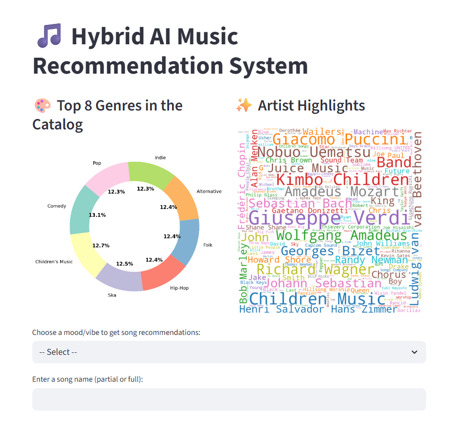

# 🎵 Hybrid AI Music Recommendation System

Welcome to **Hybrid AI Music Recommendation System** – an interactive app where anyone can discover personalized music recommendations powered by state-of-the-art AI!

**Deployed on Streamlit:**   👉 [Try the App Here!]()

*(No sign-up needed. Explore, play, and enjoy music recommendations instantly!)*

<p align="center">
  
</p>

---

## 🚀 Project Overview

This project is all about building a real-world music recommendation engine using:

* **Modern NLP models (SBERT) for text understanding**
* **FAISS for super-fast similarity search**
* **Hybrid ranking that blends musical mood, popularity, and other features**
* **A beautiful, interactive Streamlit web app**

It’s designed to:

* Show you how a real AI recommender system is built from scratch
* Teach you core ML/data science concepts in a fun way

---

## 🗂️ Project Structure

```
music-recommender-sbert-faiss/
│
├── app/                     # Streamlit app source code
│   └── streamlit_app.py
│
├── data/                    # Datasets and preprocessed files
│   ├── SpotifyFeatures_sample.csv      # Sample music data
│   ├── song_embeddings_sample.npy      # Precomputed SBERT embeddings
│   └── faiss_song_sample.index         # FAISS search index
│
├── notebooks/               # Jupyter notebooks (EDA, embedding, indexing, etc.)
│   ├── 01_eda_preprocessing.ipynb
│   ├── 02_generate_embeddings.ipynb
│   ├── 03_faiss_indexing_search.ipynb
│   └── 04_clustering_visualization.ipynb
│
├── requirements.txt         # All Python dependencies
└── README.md                # (This file!)
```

---

## 📊 The Dataset

* **Source:** [Spotify Kaggle Dataset](https://www.kaggle.com/datasets/zaheenhamidani/ultimate-spotify-tracks-db)
* **Full Dataset:** 232,725 songs × 18 features 
* **App Demo:** Uses a sample (\~15,000 tracks) for fast and free exploration
* **Features:** Genre, artist name, track name, popularity, mood/audio features (valence, danceability, etc.)

---

## 🧠 How It Works (Machine Learning Steps)

The project follows these simple but powerful steps:

### 1. Data Exploration & Cleaning

* **(See: `01_eda_preprocessing.ipynb`)**
* Load CSV, check for missing data, basic stats
* Clean and combine relevant features for later analysis

### 2. Text Embedding with SBERT

* **(See: `02_generate_embeddings.ipynb`)**
* Use **Sentence-BERT (SBERT)** to turn song/artist/genre text into **numerical vectors** (embeddings) that capture meaning/similarity

### 3. Indexing with FAISS

* **(See: `03_faiss_indexing_search.ipynb`)**
* Normalize all vectors (for cosine similarity)
* Build a **FAISS Index** for ultra-fast similarity search – this means you can find the “most similar” songs to any given track instantly!

### 4. Hybrid Recommendation & Ranking

* **In the app, for every recommendation:**

  * **Similarity:** Find songs most similar to your query song’s text

  * **Popularity:** Factor in how “popular” each song is

  * **Mood/Audio:** Use “happiness” (valence), “dance factor” (danceability), and even genre matches

  * **Hybrid Score:** Combine these with weights (e.g., 60% similarity, 15% popularity, 10% mood, 10% dance, 5% genre) to get final ranked list

  > **Bonus:** You can easily tweak these weights in the app and see how results change!

### 5. Clustering & Visualization (Bonus!)

* **(See: `04_clustering_visualization.ipynb`)**
* Cluster songs based on their features and visualize them with UMAP/plotly
* Show top genres in each cluster (great for showing model insight)

---

## 🎛️ Key Parameters You Can Change

* **Hybrid Ranking Weights**: Easily adjust how much each feature (similarity, popularity, happiness, etc.) influences the recommendations
* **Number of Recommendations:** Choose how many songs to show (slider in app)
* **Mood-Based Filtering:** Pick a “vibe” (happy, energetic, chill, sad) and get music that fits

---

## 🌟 Streamlit App Features

* **Search by Song Name**: Type any part of a song/artist, pick from results
* **Smart Recommendations**: See a table of similar songs, each with popularity, happiness, and dance factor (and YouTube link!)
* **Song Details Panel**: Pick any recommended song for more info and quick access to YouTube
* **Like Songs**: Click ❤️ to add favorites to your session
* **Mood/Vibe Recommendations**: Skip searching—just pick a mood!
* **Catalog Visualization**: Interactive donut chart of top genres and artist word cloud

---

## 💾 Files Used

* `SpotifyFeatures_sample.csv` – Song data
* `song_embeddings_sample.npy` – SBERT vector representations for all songs
* `faiss_song_sample.index` – FAISS index for fast searching

*All these are small enough for easy deployment and demo on Streamlit Cloud.*

---

## 🛠️ How to Run Locally

1. **Clone the Repo**

   ```bash
   git clone https://github.com/sagarika2325/Hybrid_AI_Music_Recommender.git
   cd Hybrid_AI_Music_Recommender
   ```

2. **Install Dependencies**

   ```bash
   pip install -r requirements.txt
   ```

3. **Run the Streamlit App**

   ```bash
   streamlit run app/streamlit_app.py
   ```

4. **Or try it live:** [Streamlit Cloud App](YOUR_STREAMLIT_LINK_HERE)

---

## 🏗️ How Each File Was Generated

* **song\_embeddings\_sample.npy:**
  Generated by running `02_generate_embeddings.ipynb` (takes text features from the CSV, encodes with SBERT)
* **faiss\_song\_sample.index:**
  Built by normalizing embeddings and using FAISS IndexFlatIP (see `03_faiss_indexing_search.ipynb`)
* **Hybrid Ranking:**
  Combines similarity + popularity + audio features with weights. Try tweaking the numbers!

---

## 🔍 Notebooks Walkthrough

* **01\_eda\_preprocessing.ipynb:**
  Inspect and clean the data; combine artist, title, genre text for embedding

* **02\_generate\_embeddings.ipynb:**
  Load SBERT, convert combined text to dense vectors, save as `.npy`

* **03\_faiss\_indexing\_search.ipynb:**
  Normalize vectors, build and save FAISS index, test some sample queries

* **04\_clustering\_visualization.ipynb:**
  Cluster songs using KMeans/UMAP, plot genre/artist clusters (shows model “understands” music)

---

## 📝 Example Use Case

> *“I want to discover more happy, danceable pop songs like ‘Shape of You’ by Ed Sheeran.”*

* Type “shape of you” in search bar
* Select the song, adjust the number of recommendations, and see results
* For any song, see happiness/dance factor scores, play on YouTube, or “like” for your session

---

## Key Highlights & Innovations

* **Modern NLP:** Uses SBERT embeddings (much stronger than bag-of-words or TF-IDF)
* **Scalable Search:** Uses FAISS (like Spotify/YouTube) for real, instant results
* **Hybrid ML Logic:** Not just one feature—multiple signals, blended
* **Great UX:** Interactive, beautiful, simple to use
* **Explainable:** Clustering, mood filters, feature sliders all help “explain” recommendations
* **Production Ready:** Designed for demo on Streamlit Cloud, easy to extend to a real app

---

## Future Work

* Add audio previews via Spotify API (if permitted)
* Allow user logins and persistent “liked” songs
* Smarter collaborative filtering (use actual user behavior)
* Even more dynamic visualizations (radar charts, user profiles)
* Scale to larger datasets (millions of tracks)

---

## Tech Stack

* **Python (pandas, numpy, scikit-learn, faiss, sentence-transformers)**
* **Streamlit** for web app
* **Jupyter Notebooks** for analysis & ML steps
* **Matplotlib, seaborn, wordcloud** for visualizations

---

## Questions?

Open an issue or contact me on [LinkedIn](https://www.linkedin.com/in/sagarikadubbaka/)!

---

## 🔗 [Live Demo on Streamlit]()


---
